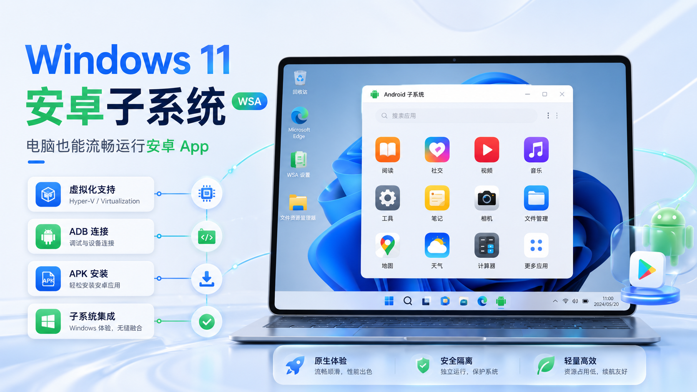

# Windows 11 安卓子系统安装教程｜电脑也能流畅运行安卓 App

以前想在电脑上运行安卓应用，很多人都会优先想到安卓模拟器。但如果只是用微信读书、安卓版微信、小红书、B站、学习软件、阅读器和工具类 App，Windows 11 安卓子系统会更像是把安卓应用直接放进 Windows 桌面里使用。

这篇文章整理一份从零开始的安装流程：包括检查虚拟化、开启 BIOS 虚拟化、安装 WSA、配置 ADB、连接安卓子系统，以及安装本地 APK。按照步骤操作，基本可以把 Windows 11 电脑变成一个更轻量的“安卓平板”。

<!-- 可选配图：如果你已经把封面图上传到 GitHub 仓库，可以取消下一行注释，并确保路径真实存在。 -->


## 一、为什么不用传统安卓模拟器

传统安卓模拟器虽然也能运行安卓 App，但常见问题比较明显：

- 占用内存高，电脑配置一般时容易卡顿；
- 启动速度慢，打开一次要等很久；
- 部分模拟器广告较多，界面不够清爽；
- 兼容性不稳定，有些 App 会出现闪退或异常；
- 长时间运行后，电脑风扇容易明显转起来。

Windows 11 安卓子系统的体验更接近系统级运行，安装完成后，安卓 App 可以像普通 Windows 软件一样从桌面打开和使用。对于学习、阅读、办公、刷内容这类轻量场景，体验会比很多模拟器更舒服。

## 二、适合安装的人

这套方案比较适合下面几类用户：

- 想在电脑上使用微信读书、B站、小红书等安卓 App 的人；
- 不想安装大型安卓模拟器的人；
- 经常在电脑上学习、看资料、阅读和办公的人；
- 希望安卓 App 像普通 Windows 软件一样打开的人；
- 电脑配置不算特别高，想要更轻量方案的人。

如果你主要是玩大型手游、需要键鼠映射、多开、脚本、游戏加速等功能，传统模拟器可能仍然更合适。

## 三、安装前准备

正式开始前，建议先准备好这些内容：

- 一台 Windows 11 电脑；
- 7-Zip 或其他解压工具；
- WSA 安装包；
- Android SDK Platform Tools，也就是 ADB 工具；
- 需要安装的 `.apk` 安卓应用安装包；
- 一个 APK 安装器类工具，方便后续选择本地 APK 安装。

注意：安装包和 APK 一定要确认来源可靠，不建议随便安装来路不明的文件。

## 四、第一步：确认电脑已经升级到 Windows 11

先打开 Windows 设置，检查电脑系统是否已经是 Windows 11。

如果已经是 Windows 11，可以直接进入下一步。

如果还不是 Windows 11，需要先升级系统。安卓子系统主要面向 Windows 11 环境，Windows 10 用户不建议直接照搬这个流程。

## 五、第二步：检查虚拟化是否开启

按下快捷键：

```text
Ctrl + Shift + Esc
```

打开任务管理器后，依次查看：

```text
任务管理器 → 性能 → CPU
```

在 CPU 页面右下角找到“虚拟化”状态。

如果显示：

```text
虚拟化：已启用
```

说明可以继续后面的安装步骤。

如果显示：

```text
虚拟化：已禁用
```

说明需要进入 BIOS 开启虚拟化。

## 六、第三步：进入 BIOS 开启虚拟化

不同品牌电脑进入 BIOS 的按键不完全一样，常见按键如下：

| 电脑品牌 | 常见进入 BIOS 按键 |
|---|---|
| 联想 | F2 / Fn + F2 |
| 华硕 | Delete / F2 |
| 惠普 | F10 |
| 戴尔 | F2 |
| 微星 | Delete |
| 宏碁 | F2 |

进入 BIOS 后，虚拟化选项的名字也可能不同。

| CPU 类型 | BIOS 中常见名称 |
|---|---|
| Intel | Intel Virtualization Technology / VT-x |
| AMD | SVM Mode / AMD-V |

常见位置一般在：

```text
Advanced
CPU Configuration
Virtualization
```

把选项从：

```text
Disabled
```

改成：

```text
Enabled
```

然后按：

```text
F10
```

保存并退出 BIOS。

重启后，再回到任务管理器检查一次，确认“虚拟化”已经变成“已启用”。

## 七、第四步：下载并解压 WSA 安装包

准备好 WSA 安装包后，用 7-Zip 解压。

解压完成后，进入安装包文件夹，找到：

```text
run.bat
```

双击运行。

如果安装过程中提示需要重启，按照提示输入：

```text
Y
```

然后重启电脑。

重启完成后，再次进入解压后的 WSA 文件夹，重新双击运行：

```text
run.bat
```

等待安装脚本执行完成。

如果看到类似“All Done”或安装完成提示，就说明 WSA 已经部署成功。

## 八、第五步：打开安卓子系统并开启开发人员模式

安装完成后，在开始菜单中找到并打开：

```text
适用于 Android™ 的 Windows 子系统
```

进入设置页面后，打开高级设置，确认：

```text
开发人员模式
```

处于开启状态。

这一步很重要，因为后面需要通过 ADB 连接安卓子系统，并安装本地 APK。

## 九、第六步：配置 ADB 环境变量

先下载并解压 Android SDK Platform Tools。

解压后，进入文件夹，复制这个文件夹路径。这个路径里一般会有下面这些文件：

```text
adb.exe
AdbWinApi.dll
AdbWinUsbApi.dll
fastboot.exe
```

然后打开 Windows 系统设置，依次进入：

```text
系统 → 系统信息 → 高级系统设置 → 环境变量
```

在“系统变量”中找到：

```text
Path
```

点击编辑，然后新建一条路径，把刚才复制的 Platform Tools 文件夹路径粘贴进去。

添加完成后，依次点击“确定”，保存所有设置。

## 十、第七步：检查 ADB 是否配置成功

按下：

```text
Win + R
```

输入：

```text
cmd
```

打开命令提示符。

输入下面命令：

```bash
adb version
```

如果能看到 ADB 版本号，说明环境变量配置成功。

如果提示：

```text
'adb' 不是内部或外部命令
```

说明 Path 环境变量没有配置正确，需要重新检查 Platform Tools 路径是否添加到了系统变量中。

## 十一、第八步：通过 ADB 连接 WSA

打开安卓子系统设置页面，查看开发人员模式下面显示的 IP 地址和端口。

原教程中的示例命令是：

```bash
adb connect 127.0.0.1:58526
```

这里的：

```text
127.0.0.1:58526
```

需要以你自己 WSA 设置页面里显示的地址为准。

如果连接成功，一般会看到类似：

```text
connected to 127.0.0.1:58526
```

如果第一次连接不成功，可以尝试：

- 重新打开安卓子系统；
- 关闭后重新开启开发人员模式；
- 重启电脑后再次执行连接命令；
- 检查端口号是否和 WSA 页面显示一致。

## 十二、第九步：安装本地 APK 应用

ADB 连接成功后，就可以安装安卓应用了。

如果已经安装了 APK 安装器，直接打开安装器，选择本地下载好的 `.apk` 文件进行安装即可。

也可以使用命令安装，例如：

```bash
adb install 应用文件名.apk
```

如果 APK 文件路径比较长，建议把 APK 放在一个简单的文件夹里，例如：

```text
D:\apk\app.apk
```

然后执行：

```bash
adb install D:\apk\app.apk
```

安装完成后，就可以在 Windows 开始菜单或安卓子系统里找到对应应用。

## 十三、APK 下载建议

如果只是安装常见安卓应用，可以选择相对常见的安卓应用下载站。

原教程中提到可以使用豌豆荚下载安卓软件：

```text
https://www.wandoujia.com/
```

下载 APK 时建议注意：

- 尽量选择常见、可信的下载来源；
- 不要安装来源不明的 APK；
- 不要安装要求异常权限的应用；
- 涉及账号、支付、隐私数据的 App，要格外谨慎。

## 十四、常见问题整理

### 1. 任务管理器显示虚拟化已禁用怎么办

进入 BIOS，把 Intel Virtualization Technology、VT-x、SVM Mode 或 AMD-V 打开。

保存退出后，重启电脑，再到任务管理器检查是否已经启用。

### 2. 运行 run.bat 后提示需要重启怎么办

按照提示输入：

```text
Y
```

重启电脑后，再次运行：

```text
run.bat
```

不要只运行一次就结束，重启后通常还需要重新执行安装脚本。

### 3. adb version 没反应或提示找不到命令怎么办

重点检查三件事：

- Platform Tools 是否已经解压；
- Path 环境变量是否添加了正确的文件夹路径；
- 修改环境变量后，是否重新打开了 cmd 窗口。

注意：不要把 `adb.exe` 文件本身加入 Path，应该添加它所在的文件夹路径。

### 4. adb connect 连接不上怎么办

可以按下面顺序排查：

- 确认 WSA 已经启动；
- 确认开发人员模式已开启；
- 确认 IP 和端口号没有写错；
- 关闭 WSA 后重新打开；
- 重启电脑后重新连接。

### 5. APK 安装失败怎么办

可能原因包括：

- APK 文件损坏；
- 应用不兼容当前安卓子系统；
- APK 来源不完整；
- 电脑安全软件拦截；
- WSA 没有正常启动。

可以换一个 APK 版本，或者重新下载后再安装。

## 十五、我的判断

Windows 11 安卓子系统更适合轻量使用场景，比如阅读、学习、办公、刷内容和运行工具类 App。它的优势是干净、启动快、体验接近原生 Windows 软件，不像传统模拟器那样臃肿。

但它并不是万能替代品。如果你需要玩大型手游、频繁多开、键盘映射、游戏宏、脚本操作，传统安卓模拟器仍然更适合。

所以更推荐的使用方式是：

- 日常学习、阅读、办公：优先考虑 Windows 安卓子系统；
- 大型手游、多开和游戏辅助：继续使用专业安卓模拟器；
- 涉及账号和隐私的 App：谨慎安装 APK，尽量使用可信来源。

## 十六、后续补充

后续如果遇到新的安装报错，可以继续补充到这里，例如：

- WSA 打不开的解决方法；
- ADB 端口变化的处理方法；
- APK 安装失败的具体报错；
- 常用安卓 App 的兼容性记录；
- 如何卸载 WSA 和清理残留文件。

按照这套流程配置完成后，你就可以在 Windows 电脑上安装并运行常用安卓应用了。
